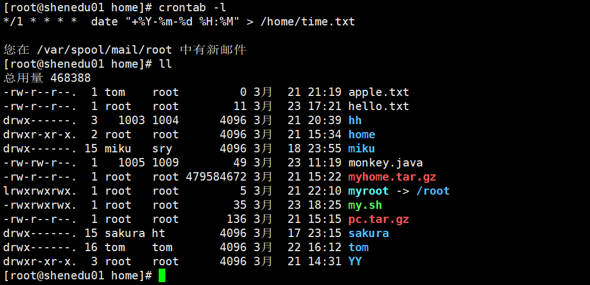
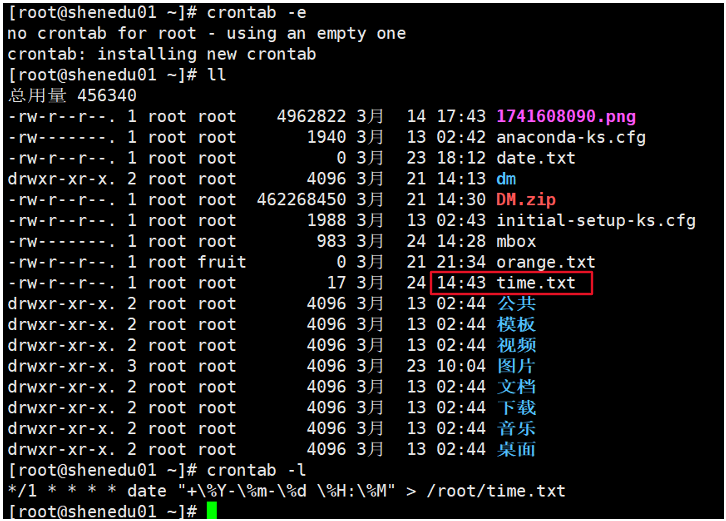

我在练习crontab时，想每分钟向 /home/time.txt输出当前时间。最初的命令可以正常执行


```

*/1 * * * *   date > /home/time.txt

```


输出内容如下（带秒的格式不是我想要的效果）

```

2026年 03月 24日 星期二 15:07:01 CST

```

为了去掉秒，让时间显示为 年-月-日  时:分   的格式 我修改了命令：

```

*/1 * * * *  date "+%Y-%m-%d %H:%M" > /home/time.txt

```

修改后，文件不再生成，系统提示有新邮件，却没有报错信息。





我在终端执行date "+%Y-%m-%d %H:%M" 正常输出，排除了命令的问题


使用mail命令查看邮件，发现错误信息提示 date命令参数异常， 怀疑是"+%Y-%m-%d %H:%M"的问题 把cron里面的"+%Y-%m-%d %H:%M" 删除后 文件可以正常输出 。


查询了相关资料确认：**cron会将%解释为换行符导致%后的内容被当标准输入，而不是命令参数，因此命令执行失败** 


解决方案


方案一：转义百分号


在%前加反斜杠 \ 进行转义：

```

*/1 * * * * date "+\%Y-\%m-\%d \%H:\%M" > /root/time.txt

```

输出效果：




方案二：通过脚本执行


编写脚本 /home/date.sh ：

```

date "+%Y-%m-%d %H:%M" > /home/time.txt

```

给脚本添加执行权限 ：

```

chomd 755  /home/date.sh

```

在crontab中调用脚本：

```

*/1 * * * * /home/date.sh

```

因为脚本中的%不会被cron特殊处理，因此不需要转义。


最后感谢大家的观看，如果我的思路存在错误 或问题，望大佬指正。

