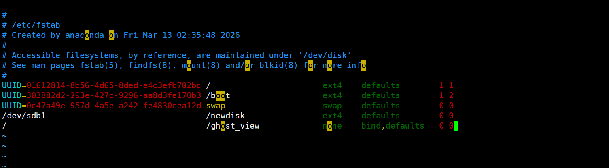

# 解决linux挂载新硬盘后文件“消失”的问题

在Linux系统中，挂载新硬盘或分区时你可能会遇到这个现象 ：原本存在与挂载点目录下的文件不见了，只剩新硬盘里的内容，文件并没有被删除，只是被 “盖住”了 ，本文我将从原理到实践帮你搞懂这个问题，并扩展到多个分区的场景 以及补充经验总结。


### 第一步 复盘梳理原因
为什么 文件不会同时存在一个目录中另一个文件去哪里了？


**执行挂载（mount）**

在根目录中创建 /newdisk目录 ，执行挂载命令将 新硬盘（sdb）挂载至该路径，并写入文件a.log

状态：此时a.log 存储在 新硬盘 （sdb）中。

<br> <br>


**执行卸载（umount）**

执行umount /dev/sdb1 操作，此时进入目录发现a.log 消失了

状态：路径回退至主硬盘 （sda） 的底层文件系统。


<br> <br>


**写入底层数据**

卸载状态下，在 /newdisk 目录中创建文件b.log

状态：此时b.log 存储在主硬盘 （sda）的底层路径中。

<br> <br>

**再次挂载**

重新执行 mount，此时 b.log 被覆盖，只能看到新硬盘中的 a.log

<br> <br>


### 第二步 解决问题 (使用 mount --bind 找到“消失的文件”)

<br>

1. 创建一个"后门"目录
在 /tmp 下创建一个临时目录，作为通往底层的梯子 

``` bash
sudo mkdir /tmp/backdoor
```
<br><br>

2. 绑定根目录（绕过挂载点）
将根目录 / 直接绑定到  /tmp/backdoor（后门）上

```bash
sudo mount --bind / /tmp/backdoor
```
<br> <br>

原理（非递归特性）
mount --bind 默认不会触发递归挂载，当你将 / 映射到 /tmp/backdoor时，它会镜像 硬盘（sda）
所在的原始数据，而不会把挂载在上面的新硬盘（sdb）也带过去。

<br><br>

3. 透过“掩蔽层”找回底层文件
通过“后门” 进入 对应的路径 ，直接访问在挂载时“消失”的底层目录 之前“消失”的文件存放在这里

```bash
cd  /tmp/backdoor/newdisk
ls -ahl
```
<br><br>

理解思路：

你可以把这个逻辑当成 一个“双层抽屉”

下层抽屉（根硬盘）：里面存放着b文件

上层抽屉（新硬盘）：你把新抽屉叠加到旧抽屉的上面，所以你打开 /newdisk 只能摸到上层的a文件。

mount --bind  /  的 操作 ：相当于你单独抽开下层的抽屉

结果：你抽出来的抽屉是那个被盖住的“下成抽屉”

<br><br>
 ### 如何创建永久挂点(防止重启失效)
刚才我们通过命令实现了临时挂载，但重启服务器后会失效下面分享如何配置 /etc/fstab 实现“永久挂载”
<br><br>
- 第一步 创建挂载点

创建一个用于查看底层的目录取名为 ghost_view(幽灵视角)

```bash
sudo mkdir /ghost_view
```

<br><br>
- 第二步 修改系统配置文件 /etc/fstab

使用 vim 或你习惯的编辑器打开配置文件

```bash
sudo vim /etc/fstab
```
<br><br>

在文件末尾添加一下配置行（注意格式对齐）：

```bash
源路径                 挂载目标              类型         参数          备份  检查
/                     /ghost_view           none     bind,defaults      0     0
```

<br>

参数说明：

类型写入none:因为这个只是路径绑定，不是挂载物理硬盘

参数bind：告诉系统这是目录间的绑定映射        

拼写注意：不要写错否则系统会报错   修改完配置文件后必须用  mount -a 测试是否正确

没有报错说明配置成功，可以放心重启 。（具体怎么配置可以参考我下面的图片内容 ，不要按照我的内容一比一复刻根据你的情况来修改）



<br><br>

# 深度思考：多分区下的“上帝视角”
<br>
提出问题：

假设我有多个分区（sdb1，sdb2，sdb3）分别挂载到了不同的目录，而我在这些目录挂载前，分别在底层磁盘中存入了 100 , 50 , 20  文件 

当所以分区全部挂载后，这些底层数据会被全部“遮蔽”如果我想不卸载的前提下，一次性查看或清理这些底层数据怎么办？
<br><br>
方案：使用 mount --bind 的非递归特性 

```bash
sudo mount --bind / /ghost_view
```
<br>
原理： mount --bind 在执行时，默认是非递归的，当你根目录 / 镜像到 /ghost_view时系统自会镜像根磁盘（sda） 本身就是目录结构和数据，而不会把挂载在它上面的其他分支（sdb1，sdb2，sdb3等抽屉）也带过去

<br><br>
拓展延伸：

为什么要加 sudo？

指令中出现的 sudo 意思为“以超级用户身份执行”

你可以抽象理解为 当你作为普通用户（非root用户）没有权限开启“房门” root用户 （老板）给了你“一把钥匙” 这个钥匙就是sudo 你可以用它打开任何系统级的授权操作 

<br>

关于tmp的临时性

/tmp是系统存放临时文件的目录 关机或重启后会被系统自动清除

我把 backdook目录建在里面关机重启后挂载会自动断开  因为mount本身就是临时性的
<br><br>
如果fstab 配置 临时目录会发生什么
<br>
结局A 启动报错 进入“紧急模式”（最有可能）

系统会在开机自检时无法找到对应文件的设备或路径，卡在自检界面 被迫进入紧急模式（Emergency Mode）这时候需要root 密码登录 手动修复文件

> 所以我们在修改完 /etc/fstab 后 要执行mount -a 验证的原因 千万不要重启
<br><br>
结局B 启动成功 但挂载失效
